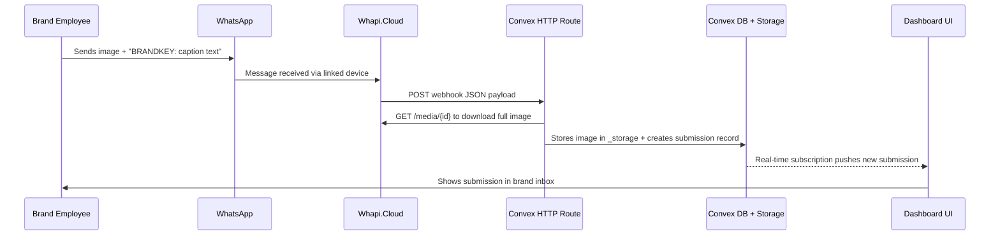

# WhatsApp Message Ingestion Plan

## Provider: Whapi.Cloud

**Why Whapi.Cloud:**

- Zero Meta verification. Scan a QR code, configure a webhook URL, done.
- Free sandbox tier (150 msgs/day) for development, $29/mo flat for production (no per-message fees).
- JSON webhook payloads with media delivered as direct download links (when `auto_download` is enabled).
- 3,300+ dev teams in production. Stable linked-device session mechanism.
- Simple REST API with Bearer token auth for fetching media.

**Number strategy:** Whapi.Cloud does not sell numbers. You bring your own:
- Option A: Buy a cheap prepaid SIM (~5 EUR), register WhatsApp on it.
- Option B: Use a virtual number service (SMSCode, GetCode, ~$1-3 one-time) to register a fresh WhatsApp account.
- Then link that WhatsApp account to Whapi.Cloud via QR code scan.

---

## Architecture



---

## Whapi.Cloud Webhook Payload (Incoming Image)

When an image message arrives, the webhook POST looks like:

```json
{
  "messages": [{
    "id": "msg-id-here",
    "from_me": false,
    "type": "image",
    "chat_id": "491234567890@s.whatsapp.net",
    "timestamp": 1719323789,
    "image": {
      "id": "jpeg-c91cf5f956dd38509d4961460cf1180e-80d1080e92fe09",
      "mime_type": "image/jpeg",
      "file_size": 25950,
      "caption": "AMZ: Just met the CEO of Goldman Sachs!",
      "link": "https://s3.eu-central-1.wasabisys.com/in-files/..."
    },
    "from": "491234567890",
    "from_name": "John"
  }],
  "event": { "type": "messages", "event": "post" },
  "channel_id": "YOUR-CHANNEL-ID"
}
```

Key points:
- `image.caption` contains the text (brand key + message)
- `image.link` is a direct download URL (available when `auto_download: ["image"]` is enabled in Whapi settings)
- Alternatively, fetch via `GET https://gate.whapi.cloud/media/{image.id}` with Bearer token
- For text-only messages, the `type` is `"text"` and content is in a `text.body` field

---

## Brand Key Mechanism

Each brand gets a unique short `ingestKey` (e.g., `"AMZ"`, `"GSACHS"`). The employee includes it at the start of their message or image caption:

```
AMZ: Just met the CEO of Goldman Sachs at the fintech summit!
```

The webhook handler parses the key (everything before the first `:`), looks up the brand, and associates the submission. If no valid key is found, the submission is stored as "unassigned" for manual triage.

---

## Implementation Steps

### 1. Schema: Add `submissions` table and brand `ingestKey`

In [convex/schema.ts](convex/schema.ts):

- Add `ingestKey` field to the `brands` table (short unique string, indexed)
- Add new `submissions` table:

```typescript
submissions: defineTable({
  brandId: v.optional(v.id('brands')),
  agencyId: v.id('agencies'),
  senderPhone: v.string(),
  senderName: v.optional(v.string()),
  messageBody: v.string(),
  imageStorageId: v.optional(v.id('_storage')),
  status: v.union(
    v.literal('pending'),
    v.literal('processing'),
    v.literal('published'),
    v.literal('rejected'),
  ),
  rawPayload: v.optional(v.string()),
  createdAt: v.number(),
})
  .index('by_brand', ['brandId'])
  .index('by_agency', ['agencyId'])
  .index('by_status', ['status'])
```

### 2. Convex HTTP Webhook Endpoint

In [convex/http.ts](convex/http.ts), add a POST route `/whapi/webhook`:

- Parse the JSON body (Whapi.Cloud sends `application/json`)
- Filter: only process messages where `from_me === false` and `event.type === "messages"`
- For each message in `messages[]`:
  - Determine text content: `image.caption` for image messages, `text.body` for text messages
  - Parse brand key from the text (everything before first `:`)
  - Look up brand by `ingestKey` index
  - If image: fetch full-res image from `image.link` (or `GET /media/{image.id}` with Bearer token), store in Convex `_storage`
  - Call internal mutation to create `submissions` record
- Return `200 OK` with `{ "status": "ok" }`

### 3. Convex Backend Functions

New file `convex/submissions.ts`:

- `ingestFromWebhook` (httpAction): handles the webhook POST, downloads media, calls mutation
- `createSubmission` (internal mutation): creates the submission record
- `listByBrand` (query): fetches submissions for a brand with real-time updates, resolves image URLs
- `listByAgency` (query): fetches all submissions across all agency brands
- `updateStatus` (mutation): allows agency owner to approve/reject/process a submission

### 4. Environment Variables

Add to Convex environment (via Convex dashboard):
- `WHAPI_API_TOKEN` — your Whapi.Cloud channel API token (used for media downloads)

### 5. Whapi.Cloud Setup (Manual, one-time)

1. Create account at whapi.cloud
2. Link a WhatsApp number via QR code scan (Settings > Linked Devices on phone)
3. Enable `auto_download` for images in channel settings:
   ```
   PATCH /settings → { "media": { "auto_download": ["image"] } }
   ```
4. Configure webhook URL pointing to your Convex HTTP endpoint:
   ```
   PATCH /settings → {
     "webhooks": [{
       "events": [{ "type": "messages", "method": "post" }],
       "mode": "body",
       "url": "https://<your-deployment>.convex.site/whapi/webhook"
     }]
   }
   ```

### 6. Frontend: Submissions Inbox UI

New page at `app/(dashboard)/brands/[brandId]/submissions/page.tsx`:

- Uses `useQuery(api.submissions.listByBrand, { brandId })` for real-time data
- Displays a feed/grid of submissions: image thumbnail, message text, sender name/phone (masked), timestamp, status badge
- Click to expand: full image, approve/reject actions
- Empty state explaining how employees can submit (WhatsApp number + brand key instructions)

---

## What This Does NOT Cover (Future Work)

- AI post generation from submissions (uses brand identity context to create compliant posts)
- Auto-publishing to LinkedIn/Instagram/Facebook
- Reply to the WhatsApp user with the generated post (via Whapi.Cloud send message API)
- Multiple images per submission (WhatsApp sends 1 media per message; could batch by timestamp)
- Sender allowlisting (restrict who can submit per brand)
