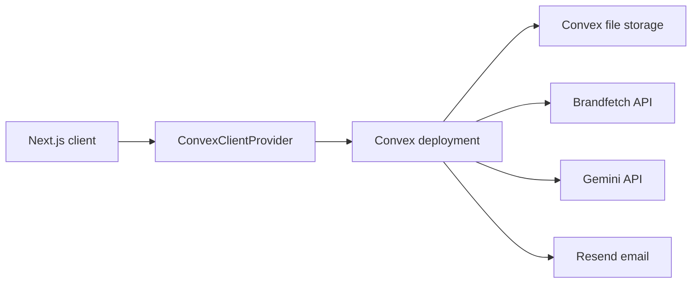

# Architecture

How the Next.js frontend, Convex backend, and external services fit together.

## Table of Contents

- [High-level view](#high-level-view)
- [Frontend](#frontend)
- [Backend (Convex)](#backend-convex)
- [Server function types](#server-function-types)
- [File storage](#file-storage)
- [External services](#external-services)
- [Related documentation](#related-documentation)

## High-level view

The client talks only to Convex. Convex queries and mutations run in Convex's runtime; actions (which may call external APIs) run separately and reach out to Brandfetch, Gemini, and Resend.

## Frontend

- App Router with route groups. The `(dashboard)` group holds authenticated screens; marketing and auth pages live at the top level.
- `app/ConvexClientProvider.tsx` wires the Convex React client and auth context; it is mounted in `app/layout.tsx`.
- Data is read with `useQuery` and written with `useMutation` / `useAction` from `convex/react`. Queries are reactive, so UI updates automatically when data changes.

## Backend (Convex)

All server code lives in `convex/`. The schema is defined in `convex/schema.ts`. Each domain has its own module:

- `agencies.ts`, `brands.ts`, `brandPersonas.ts`, `brandContentBuckets.ts`, `waitlist.ts` — domain functions.
- `brandImport.ts` — import actions (Node runtime): Brandfetch website import and Gemini brand-book extraction.
- `auth.ts`, `auth.config.ts`, `http.ts` — authentication and HTTP routes.

## Server function types

- Query — read-only, reactive. Used for fetching brands, agencies, personas, etc.
- Mutation — transactional writes. Used for create/update/delete. Internal mutations (for example `brands.applyImport`) are callable only from other Convex functions, not the client.
- Action — non-transactional, may perform side effects and call external APIs. Actions cannot touch the database directly; they call queries/mutations via `ctx.runQuery` / `ctx.runMutation`. The brand-book action declares `'use node'` to run in the Node runtime for the Gemini SDK.

## File storage

Logos, icons, fonts, imagery, reference-post screenshots, and uploaded PDFs are stored in Convex storage. The client requests an upload URL from a mutation (for example `brands.generateBrandUploadUrl`), POSTs the file, and stores the returned `storageId`. Read URLs are resolved server-side (for example in `brands.getWithMedia`).

## External services

- Brandfetch — domain-based brand data (logo, colors, fonts) for website import.
- Google Gemini — structured extraction of brand-book PDFs (default model `gemini-3.5-flash`).
- Resend — transactional email for the email auth provider.
- Photon (komoot) — client-side address autocomplete in registration and onboarding.

## Related documentation

- [02-data-model.md](02-data-model.md) — schema and relationships.
- [03-authentication-and-registration.md](03-authentication-and-registration.md) — auth providers and ownership.
- [10-brand-import-and-references.md](10-brand-import-and-references.md) — import action details.
