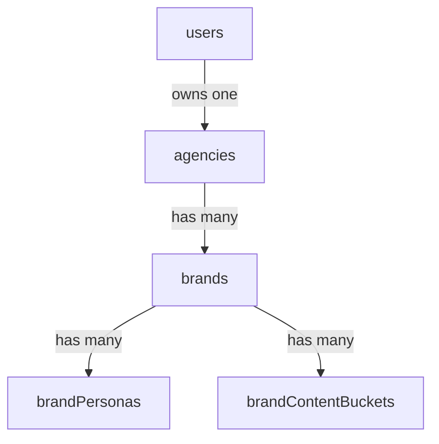

# Data Model

Reference for the Convex schema in `convex/schema.ts` and the relationships between tables.

## Table of Contents

- [Relationships](#relationships)
- [Ownership model](#ownership-model)
- [Tables](#tables)
  - [agencies](#agencies)
  - [brands](#brands)
  - [brandPersonas](#brandpersonas)
  - [brandContentBuckets](#brandcontentbuckets)
  - [accessCodes](#accesscodes)
  - [waitlist](#waitlist)
  - [auth tables](#auth-tables)
- [Related documentation](#related-documentation)

## Relationships

## Ownership model

A user owns exactly one agency (`agencies.by_owner` is queried with `.unique()`). An agency owns many brands. A brand owns many personas and content buckets. Every brand-scoped function verifies ownership by walking brand to `agencyId` to `agency.ownerId` and comparing it with the authenticated user (the `assertBrandOwner` helper in `brands.ts`, `brandPersonas.ts`, and `brandContentBuckets.ts`).

## Tables

### agencies

The tenant. One per user.

- `ownerId` (ref `users`), `name`, `website?`, `phone?`, `brandColor?`
- `logoFileName?`, `logoStorageId?` (Convex storage)
- Address: `street`, `number`, `zip`, `city`, `country`
- `accessCode`, `createdAt`
- Indexes: `by_owner`, `by_access_code`

### brands

A client of the agency. Holds all onboarding data as nested optional objects.

- `agencyId` (ref `agencies`), `name`, `status` (`active` | `inactive` | `paused`), `website?`, `createdAt`
- Onboarding progress: `onboardingStep?`, `onboardingCompletedAt?`
- Import metadata: `importSource?` (`website` | `brandbook`), `importedAt?`
- Brand-book artifact: `brandBookStorageId?` — the uploaded brand-book PDF, kept for reference (see [10-brand-import-and-references.md](10-brand-import-and-references.md))
- `generalInfo?` — language, location, contact name/email
- `companyProfile?` — field of business, core identity, core message, tagline, mission, vision, values, products, reasons to believe, key messages
- `visualIdentity?` — `logoStorageId`, `iconStorageIds` (array), `photographyStorageIds` and `illustrationStorageIds` (arrays), primary/secondary colors, gradients (type and angle), headline/subline font ids and names (plus deprecated `iconStorageId`, `imageryStorageIds`, and dark/light logo/icon fields kept for backward compatibility)
- `voice?` — archetype, attributes, point of view, formality, emoji usage, words to use/avoid, sample posts (plus deprecated `tonalityExample`)
- `guardrails?` — topics to avoid, banned claims, mandatory disclaimers
- `referencePosts?` — array of `{ url?, caption?, imageStorageId?, channel? }`
- `channels?` — array of `linkedin` | `instagram` | `facebook`
- Index: `by_agency`

### brandPersonas

Per-channel audience definitions.

- `brandId` (ref `brands`), `channel`, `name`
- `shortDescription?`, `gender?`, `ageMin?`, `ageMax?`, `location?`, `profession?`, `goals?`, `challenges?`, `interests?`
- `order`, `createdAt`
- Indexes: `by_brand`, `by_brand_channel`

### brandContentBuckets

Per-channel content plans.

- `brandId` (ref `brands`), `channel`, `title`
- `description?`, `goal?`, `mediaType?`, `dos?`, `donts?`, `useEmojis?`, `exampleCaption?`, `usePrimarySources?`
- Schedule: `scheduleDays?`, `scheduleTime?`, `isActive?`
- `order`, `createdAt`
- Indexes: `by_brand`, `by_brand_channel`

### accessCodes

Gates agency registration.

- `code`, `usesRemaining`, `createdAt`
- Index: `by_code`
- A fallback set of always-valid codes also exists in `agencies.ts` for development.

### waitlist

Pre-launch sign-ups from the marketing site.

- `fullName`, `email`, `agencyName`, `phone?`, `referralSource?`, `createdAt`
- Index: `by_email`

### auth tables

Provided by `@convex-dev/auth` via `authTables` (users, sessions, accounts, etc.). See [03-authentication-and-registration.md](03-authentication-and-registration.md).

## Related documentation

- [01-architecture.md](01-architecture.md) — how the schema is accessed.
- [04-brand-onboarding-wizard.md](04-brand-onboarding-wizard.md) — how the brand fields are populated.
