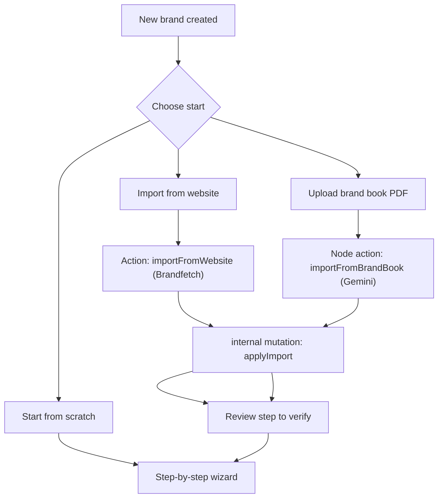

# Brand Import and Reference Posts

How agencies can accelerate brand onboarding by importing brand data from a website domain or a brand-book PDF, and how brands can reference real published posts. All importers prefill the existing onboarding draft and route the user to the Review step to verify.

## Table of Contents

- [Overview](#overview)
- [Architecture](#architecture)
- [Data model](#data-model)
- [Import paths](#import-paths)
  - [Website import (Brandfetch)](#website-import-brandfetch)
  - [Brand book PDF import (Gemini)](#brand-book-pdf-import-gemini)
- [Reference posts](#reference-posts)
- [Configuration](#configuration)
- [Files](#files)
- [Limitations and risks](#limitations-and-risks)

## Overview

Brand onboarding is an eight-step wizard. To reduce the friction of filling it in manually, three accelerators exist:

1. Import from website domain — pulls logo, colors, fonts, and basics.
2. Upload a brand-book PDF — extracts voice, values, colors, and messaging via an LLM.
3. Reference previous posts — links real published content so the agent learns the actual format, length, and media style.

The guiding principle: importers are accelerators, not parallel flows. Every input maps into the existing `brands` schema and lands the user on the Review step (step 8) to verify. The wizard stays the single source of truth.

## Architecture



Convex actions cannot access the database directly, so both importers resolve their data and then call the internal mutation `applyImport`, which merges fields into the brand document, sets `importSource` and `importedAt`, and advances `onboardingStep` to 8.

The pre-wizard entry screen is only shown when a brand is completely fresh (no `onboardingCompletedAt`, no `importSource`, `onboardingStep <= 1`, and no `generalInfo` / `companyProfile` / `visualIdentity`). Once any data exists the wizard renders normally.

## Data model

Added to the `brands` table in `convex/schema.ts`:

```ts
importSource: v.optional(v.union(v.literal('website'), v.literal('brandbook'))),
importedAt: v.optional(v.number()),

// Original uploaded brand-book PDF, kept for reference.
brandBookStorageId: v.optional(v.id('_storage')),

referencePosts: v.optional(
  v.array(
    v.object({
      url: v.optional(v.string()),
      caption: v.optional(v.string()),
      imageStorageId: v.optional(v.id('_storage')),
      channel: v.optional(/* linkedin | instagram | facebook */),
    }),
  ),
),
```

Reference-post image URLs are resolved server-side in `brands.getWithMedia` and exposed as `media.referencePostImageUrls` (index-aligned with `referencePosts`).

## Import paths

### Website import (Brandfetch)

`importFromWebsite({ brandId, domain })` in `convex/brandImport.ts`:

1. Verifies ownership via `brands.getById`.
2. Normalizes the domain (strips protocol, `www.`, path).
3. Calls the Brandfetch Brand API (`GET https://api.brandfetch.io/v2/brands/{domain}`).
4. Stores the logo and icon images into Convex storage (`ctx.storage.store`).
5. Maps colors (accent/brand to primary, dark/light to secondary), fonts (title to headline, body to subline), and description to core identity.
6. Calls `applyImport`.

### Brand book PDF import (Gemini)

`importFromBrandBook({ brandId, storageId })` in `convex/brandImport.ts` (runs in the Node runtime via `'use node'`):

1. Verifies ownership and reads the PDF blob from storage.
2. Base64-encodes the PDF and sends it to Gemini as a native `inlineData` PDF part.
3. Requests structured output via a `responseSchema`, so the model returns JSON covering as much of the wizard as it can infer: `name`, `generalInfo` (language, location, contact), `companyProfile` (fieldOfBusiness, coreIdentity, coreMessage, tagline, mission, vision, values, products, reasonsToBelieve, keyMessages), `visualIdentity` (primaryColors, secondaryColors, headline/subline font names), `voice` (archetype, attributes, pointOfView, formality, emojiUsage, wordsToUse, wordsToAvoid, samplePosts), and `guardrails` (topicsToAvoid, bannedClaims, mandatoryDisclaimers).
4. Select-backed fields (`language`, `fieldOfBusiness`, `pointOfView`, `formality`, `emojiUsage`, `archetype`) are constrained to the wizard's exact option values and validated server-side before being merged.
   - Colors are returned per swatch with whatever notations the brand book prints (HEX, RGB, CMYK, Pantone/PMS) plus an `estimatedHex` fallback. The server normalizes each swatch to a single `#RRGGBB` hex with priority HEX → RGB → CMYK → estimate (RGB/CMYK converted deterministically), de-duplicates, and stores the result in `primaryColors` / `secondaryColors`.
5. Maps the result into `name`, `generalInfo`, `companyProfile`, `visualIdentity`, `voice`, and `guardrails`, then calls `applyImport` and persists `brandBookStorageId` (the uploaded PDF is kept for reference).

The model is configurable via `GEMINI_MODEL` and defaults to `gemini-3.5-flash`.

## Reference posts

Edited in Step 4 (Voice) via `ReferencePostsCard` and surfaced in the Review step. Each entry supports an optional channel, post URL, a short note ("why this post"), and a screenshot upload. Distinct from the tone "sample posts" already in Step 4: sample posts are voice examples the agent mimics, reference posts point to real published content.

## Configuration

Both importers require API keys set as Convex environment variables. The actions fail with a clear "not configured" message until these are present:

```bash
npx convex env set BRANDFETCH_API_KEY your_brandfetch_key
npx convex env set GEMINI_API_KEY your_gemini_key

# Optional, defaults to gemini-3.5-flash
npx convex env set GEMINI_MODEL your_preferred_model_slug
```

`GOOGLE_API_KEY` is accepted as a fallback for `GEMINI_API_KEY`.

## Files

- `convex/schema.ts` — `referencePosts`, `importSource`, `importedAt`, `brandBookStorageId`.
- `convex/brands.ts` — `updateOnboarding` arg, `getWithMedia` URL resolution, internal `applyImport` mutation.
- `convex/brandImport.ts` — `importFromWebsite` and `importFromBrandBook` actions.
- `components/brand-setup/import-start.tsx` — pre-wizard entry screen.
- `components/brand-setup/reference-posts.tsx` — reference posts card.
- `components/brand-setup/steps/step-review.tsx` — import banner and reference-posts section.
- `app/(dashboard)/brands/[brandId]/setup/page.tsx` — entry-screen gating and post-import routing.

## Limitations and risks

- Imports are best-effort drafts. The Review step shows a banner instructing the user to verify every section; onboarding is never auto-completed.
- PDF extraction quality varies with the brand book. Logos, icons, and other images are not extracted from the PDF; only text-derived fields and font names are captured. The uploaded PDF is stored (`brandBookStorageId`) for reference, and users upload visual assets manually in the Visual Identity step.
- Brandfetch stores third-party logos; respect the Brandfetch terms of service and treat all imported values as editable defaults.
- The Gemini model slug must be valid and PDF-capable for the brand-book path to work; otherwise the action errors and the message surfaces in the entry screen. Gemini accepts PDFs up to 50 MB / 1000 pages (the upload UI caps at 25 MB).
- Frontify and other DAM OAuth integrations are intentionally out of scope (enterprise, per-tenant OAuth, brand must be a customer of the tool).
